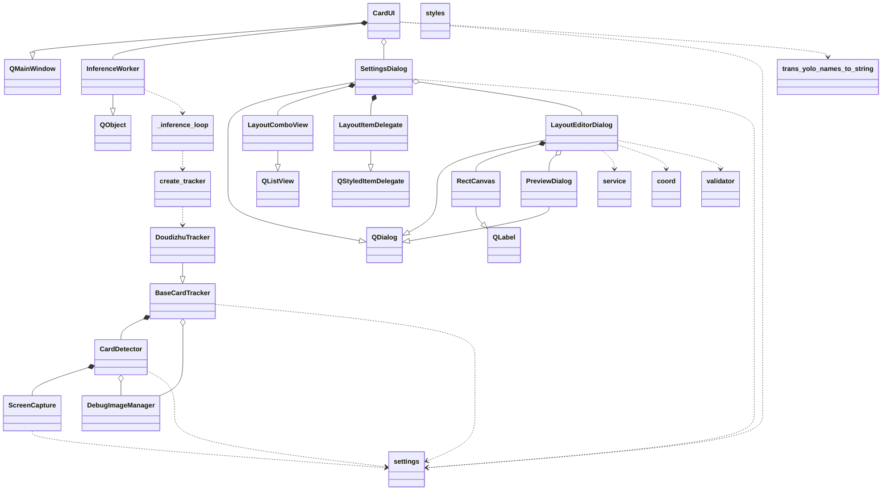

# 类图概览 - Han记牌器

> 只展示类名和关系，不展开属性/方法。详细版见 [class-diagram.md](class-diagram.md)。



## 关系图例

| 符号 | 含义 | 说明 |
|------|------|------|
| `*--` | 组合 | A 创建并持有 B，B 随 A 的销毁而销毁 |
| `o--` | 聚合 | A 按需创建 B 或共享 B 的单例 |
| `..>` | 依赖 | A 使用 B（调用函数/读取配置） |
| `--\|>` | 继承 | A 继承自 B |

## 数据流主线

```
CardUI → InferenceWorker → _inference_loop(子进程) → create_tracker → DoudizhuTracker → CardDetector → ScreenCapture
                                                                            ↓
                                                                       BaseCardTracker
                                                                       YOLO Model
```
