# 类图概览 - Han记牌器

> 只展示类名和关系，不展开属性/方法。详细版见 [class-diagram.md](class-diagram.md)。

```mermaid
classDiagram
    direction TB

    %% ========== UI 层 ==========
    class CardUI {
        +request_one_update()
        +on_result_ready()
        +on_settings_clicked()
        +on_pause_clicked()
        +on_reset_clicked()
        +on_layout_changed()
        +on_device_changed()
        +on_model_changed()
        +on_game_changed()
    }
    class SettingsDialog {
        +set_current_*()
        +refresh_layout_list()
    }
    class LayoutEditorDialog {
        +saved_layout_name: str
        +saved_set_current: bool
    }
    class RectCanvas {
        +rect_changed: Signal
        +set_pixmap_from_pil()
        +fit_to_viewport()
        +set_rects() / get_rects()
    }
    class PreviewDialog {
        +show_preview()
    }
    class LayoutItemDelegate {
        +paint()
    }
    class LayoutComboView {
        +mousePressEvent()
    }

    %% ========== 推理层 ==========
    class InferenceWorker {
        +result_ready: Signal
        +error: Signal
        +finished: Signal
        +start() / stop()
        +request_detect() / request_reset()
        +switch_layout() / switch_model() / switch_device() / switch_game()
        +update_settings() / touch_time()
    }
    class GameController {
        +detect()
        +reset()
        +switch_layout()
        +switch_model()
        +switch_device()
        +switch_game()
        +update_settings()
        +touch_time()
    }

    %% ========== 核心层 ==========
    class BaseCardTracker {
        <<abstract>>
        +get_cards_number()
        +translate_boxes_to_cards()
        +reset()
        +run_game()
        #_presses_one_frame()
        #_check_card()
        #_delete_played_cards()
        #_process_all_played_zones()
        #_get_validity_region()* str
        +should_start_game()* bool
        +should_start_recording()* bool
        +on_game_started()*
        +on_start_recording()*
        +process_played_cards()*
    }
    class DoudizhuTracker {
        +_get_validity_region() str
        +should_start_game() bool
        +should_start_recording() bool
        +on_game_started()
        +on_start_recording()
        +process_played_cards()
    }
    class YoloInferencer {
        +detect(img) tuple
        -__load_model() tuple
        -__load_tensorrt() YOLO
        -__load_onnx() YOLO
    }
    class LayoutAnalyzer {
        +parse_and_sort(raw_result, img_size) dict
        +sort_cards_by_topright_rowwise(dets, max_rows) list
    }
    class ScreenCapture {
        +capture_window() PIL.Image
    }
    class ImageSaver {
        +bootstrap()
        +start_new_game()
        +save_frame()
        +set_enabled()
    }

    %% ========== 配置层 ==========
    class settings {
        <<module>>
        +BASE_DIR / RESOURCE_DIR
        +CONFIG_PATH
        +WINDOW_LAYOUTS / CURRENT_LAYOUT
        +TOTAL_CARDS / PLAYED_ZONES / LAYOUT_REGIONS
        +YOLO_TO_CARD_MAPPING
        +GAME_NAME / GAME_DISPLAY_NAME
        +load_config()
        +save_*()
    }

    %% ========== 工具层 ==========
    class coord {
        <<module>>
        +REGION_KEYS
        +normalize_rect() / denormalize_rect()
        +sanitize_pixel_rect()
        +normalize_layout()
    }
    class service {
        <<module>>
        +list_visible_window_titles()
        +capture_window_by_title()
        +get_layout_config()
        +save_layout()
    }
    class validator {
        <<module>>
        +validate_normalized_layout()
        +build_preview_image()
    }
    class trans_yolo_names_to_string {
        <<module>>
        +tool_trans()
        +trans_yolo_names_to_string()
    }
    class styles {
        <<module>>
        +load_qss()
    }

    %% ========== 继承 ==========
    CardUI --|> QMainWindow
    SettingsDialog --|> QDialog
    LayoutEditorDialog --|> QDialog
    PreviewDialog --|> QDialog
    RectCanvas --|> QLabel
    InferenceWorker --|> QObject
    LayoutItemDelegate --|> QStyledItemDelegate
    LayoutComboView --|> QListView
    DoudizhuTracker --|> BaseCardTracker

    %% ========== 组合（创建并持有） ==========
    CardUI *-- InferenceWorker
    LayoutEditorDialog *-- RectCanvas
    SettingsDialog *-- LayoutComboView
    SettingsDialog *-- LayoutItemDelegate
    GameController *-- ScreenCapture
    GameController *-- YoloInferencer
    GameController *-- LayoutAnalyzer
    GameController *-- BaseCardTracker
    GameController *-- ImageSaver

    %% ========== 聚合（按需创建/共享） ==========
    CardUI o-- SettingsDialog
    SettingsDialog o-- LayoutEditorDialog
    LayoutEditorDialog o-- PreviewDialog

    %% ========== 依赖 ==========
    CardUI ..> settings
    CardUI ..> trans_yolo_names_to_string
    SettingsDialog ..> settings
    LayoutEditorDialog ..> service
    LayoutEditorDialog ..> coord
    LayoutEditorDialog ..> validator
    InferenceWorker ..> GameController : 创建子进程实例
    GameController ..> BaseCardTracker : 通过 create_tracker() 工厂创建
    BaseCardTracker ..> settings
    YoloInferencer ..> settings
```



## 关系图例

| 符号 | 含义 | 说明 |
|------|------|------|
| `*--` | 组合 | A 创建并持有 B，B 随 A 的销毁而销毁 |
| `o--` | 聚合 | A 按需创建 B 或共享 B 的单例 |
| `..>` | 依赖 | A 使用 B（调用函数/读取配置） |
| `--\|>` | 继承 | A 继承自 B |

## 数据流主线

```
CardUI → InferenceWorker → run_controller_loop(子进程) → GameController ─┬─ ScreenCapture (截图)
                                                                          ├─ YoloInferencer (YOLO 纯视觉推理)
                                                                          ├─ LayoutAnalyzer (几何分区与排序)
                                                                          ├─ ImageSaver (调试图片保存)
                                                                          └─ Tracker (状态机 / 业务映射)
```
