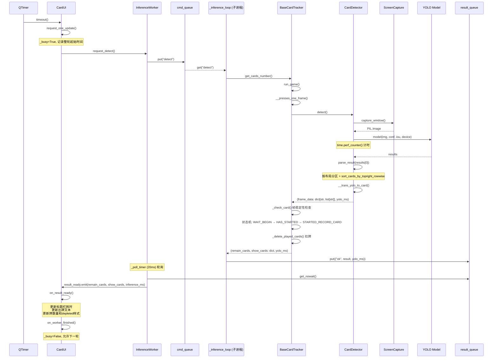
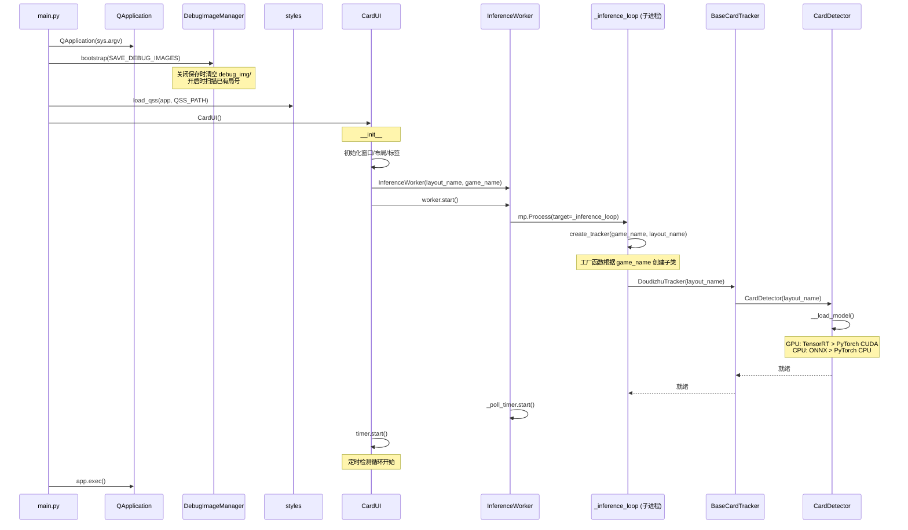
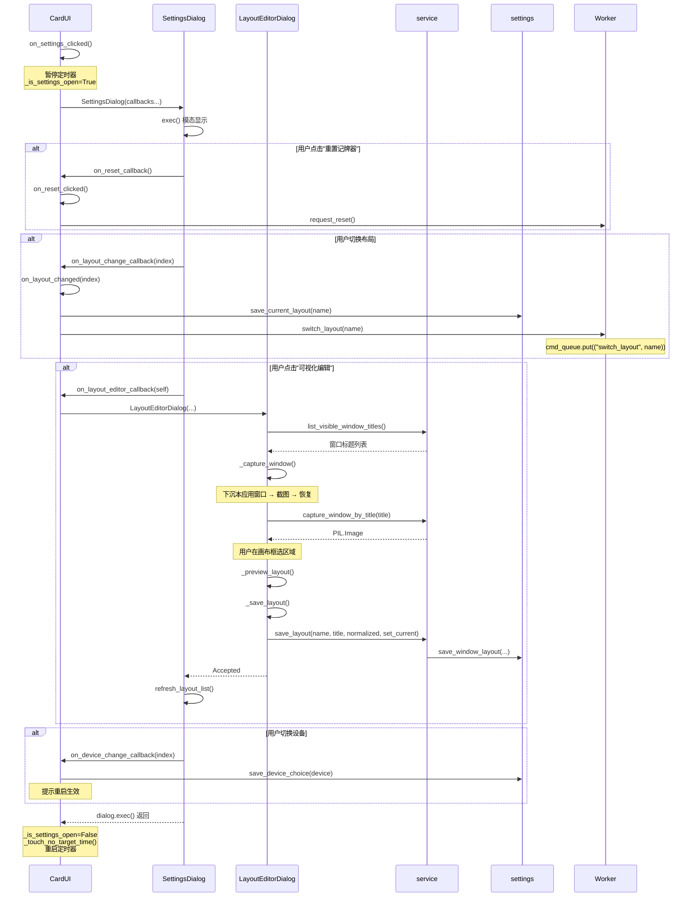
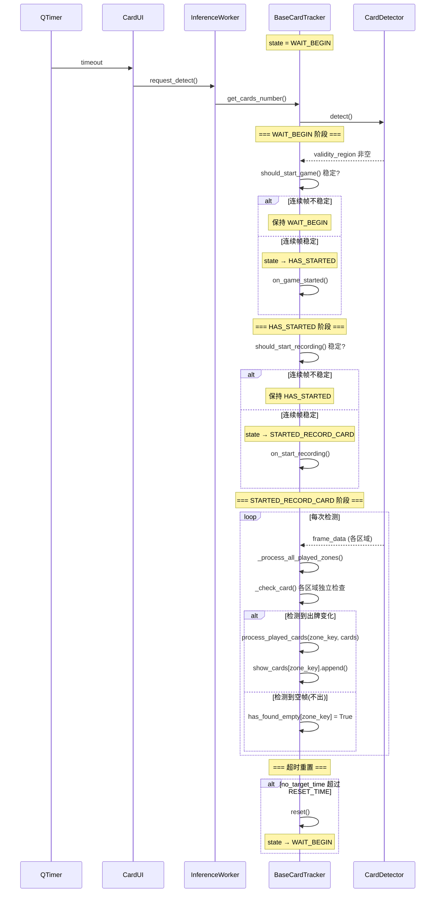
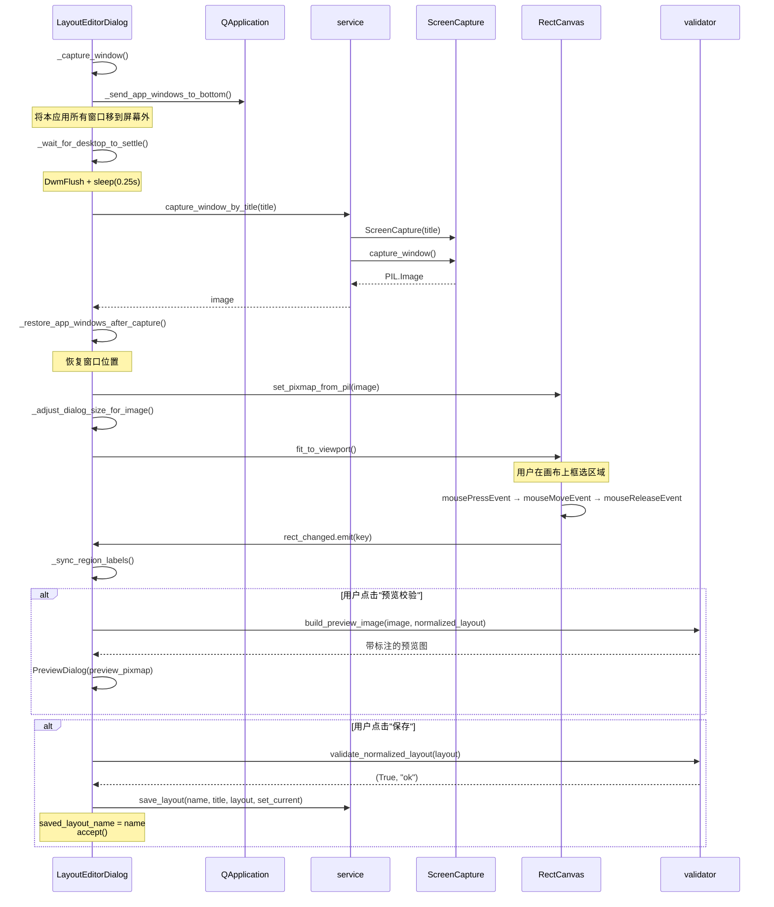

# 顺序图 - Han记牌器

> 展示核心业务流程中各对象之间的消息传递时序

---

## 1. 一次完整的检测流程

```mermaid
sequenceDiagram
    participant Timer as QTimer
    participant UI as CardUI
    participant Worker as InferenceWorker
    participant CmdQ as cmd_queue
    participant SubProc as _inference_loop (子进程)
    participant Tracker as BaseCardTracker
    participant Detector as CardDetector
    participant Capture as ScreenCapture
    participant YOLO as YOLO Model
    participant ResultQ as result_queue

    Timer->>UI: timeout()
    UI->>UI: request_one_update()
    Note over UI: _busy=True, 记录整轮起始时间
    UI->>Worker: request_detect()
    Worker->>CmdQ: put("detect")

    CmdQ-->>SubProc: get("detect")
    SubProc->>Tracker: get_cards_number()
    Tracker->>Tracker: run_game()
    Tracker->>Tracker: __presses_one_frame()
    Tracker->>Detector: detect()

    Detector->>Capture: capture_window()
    Capture-->>Detector: PIL.Image
    Detector->>YOLO: model(img, conf, iou, device)
    Note over Detector: time.perf_counter() 计时
    YOLO-->>Detector: results
    Detector->>Detector: parse_result(results[0])
    Note over Detector: 按布局分区 + sort_cards_by_topright_rowwise
    Detector->>Detector: __trans_yolo_to_card()
    Detector-->>Tracker: (frame_data: dict[str, list[str]], yolo_ms)

    Tracker->>Tracker: _check_card() 帧稳定性检查
    Tracker->>Tracker: 状态机: WAIT_BEGIN → HAS_STARTED → STARTED_RECORD_CARD
    Tracker->>Tracker: _delete_played_cards() 扣牌
    Tracker-->>SubProc: (remain_cards, show_cards: dict, yolo_ms)

    SubProc->>ResultQ: put(("ok", result, yolo_ms))

    Note over Worker: _poll_timer (20ms) 轮询
    Worker->>ResultQ: get_nowait()
    Worker->>UI: result_ready.emit(remain_cards, show_cards, inference_ms)

    UI->>UI: on_result_ready()
    Note over UI: 更新标题栏耗时<br/>更新出牌文本<br/>更新牌数量和depleted样式
    UI->>UI: on_worker_finished()
    Note over UI: _busy=False, 允许下一轮
```

---

## 2. 应用启动流程

```mermaid
sequenceDiagram
    participant Main as main.py
    participant App as QApplication
    participant DebugMgr as DebugImageManager
    participant Styles as styles
    participant UI as CardUI
    participant Worker as InferenceWorker
    participant SubProc as _inference_loop (子进程)
    participant Tracker as BaseCardTracker
    participant Detector as CardDetector

    Main->>App: QApplication(sys.argv)
    Main->>DebugMgr: bootstrap(SAVE_DEBUG_IMAGES)
    Note over DebugMgr: 关闭保存时清空 debug_img/<br/>开启时扫描已有局号
    Main->>Styles: load_qss(app, QSS_PATH)
    Main->>UI: CardUI()

    Note over UI: __init__
    UI->>UI: 初始化窗口/布局/标签
    UI->>Worker: InferenceWorker(layout_name, game_name)
    UI->>Worker: worker.start()

    Worker->>SubProc: mp.Process(target=_inference_loop)
    SubProc->>SubProc: create_tracker(game_name, layout_name)
    Note over SubProc: 工厂函数根据 game_name 创建子类
    SubProc->>Tracker: DoudizhuTracker(layout_name)
    Tracker->>Detector: CardDetector(layout_name)
    Detector->>Detector: __load_model()
    Note over Detector: GPU: TensorRT > PyTorch CUDA<br/>CPU: ONNX > PyTorch CPU
    Detector-->>Tracker: 就绪
    Tracker-->>SubProc: 就绪

    Worker->>Worker: _poll_timer.start()
    UI->>UI: timer.start()
    Note over UI: 定时检测循环开始
    Main->>App: app.exec()
```

---

## 3. 设置对话框交互流程

```mermaid
sequenceDiagram
    participant UI as CardUI
    participant SD as SettingsDialog
    participant LED as LayoutEditorDialog
    participant Service as service
    participant Settings as settings

    UI->>UI: on_settings_clicked()
    Note over UI: 暂停定时器<br/>_is_settings_open=True
    UI->>SD: SettingsDialog(callbacks...)
    SD->>SD: exec() 模态显示

    alt 用户点击"重置记牌器"
        SD->>UI: on_reset_callback()
        UI->>UI: on_reset_clicked()
        UI->>Worker: request_reset()
    end

    alt 用户切换布局
        SD->>UI: on_layout_change_callback(index)
        UI->>UI: on_layout_changed(index)
        UI->>Settings: save_current_layout(name)
        UI->>Worker: switch_layout(name)
        Note over Worker: cmd_queue.put(("switch_layout", name))
    end

    alt 用户点击"可视化编辑"
        SD->>UI: on_layout_editor_callback(self)
        UI->>LED: LayoutEditorDialog(...)
        LED->>Service: list_visible_window_titles()
        Service-->>LED: 窗口标题列表
        LED->>LED: _capture_window()
        Note over LED: 下沉本应用窗口 → 截图 → 恢复
        LED->>Service: capture_window_by_title(title)
        Service-->>LED: PIL.Image
        Note over LED: 用户在画布框选区域
        LED->>LED: _preview_layout()
        LED->>LED: _save_layout()
        LED->>Service: save_layout(name, title, normalized, set_current)
        Service->>Settings: save_window_layout(...)
        LED-->>SD: Accepted
        SD->>SD: refresh_layout_list()
    end

    alt 用户切换设备
        SD->>UI: on_device_change_callback(index)
        UI->>Settings: save_device_choice(device)
        Note over UI: 提示重启生效
    end

    SD-->>UI: dialog.exec() 返回
    Note over UI: _is_settings_open=False<br/>_touch_no_target_time()<br/>重启定时器
```

---

## 4. 状态机转换流程

```mermaid
sequenceDiagram
    participant Timer as QTimer
    participant UI as CardUI
    participant Worker as InferenceWorker
    participant Tracker as BaseCardTracker
    participant Detector as CardDetector

    Note over Tracker: state = WAIT_BEGIN

    Timer->>UI: timeout
    UI->>Worker: request_detect()
    Worker->>Tracker: get_cards_number()
    Tracker->>Detector: detect()

    Note over Tracker: === WAIT_BEGIN 阶段 ===
    Detector-->>Tracker: validity_region 非空
    Tracker->>Tracker: should_start_game() 稳定?
    alt 连续帧不稳定
        Note over Tracker: 保持 WAIT_BEGIN
    else 连续帧稳定
        Note over Tracker: state → HAS_STARTED
        Tracker->>Tracker: on_game_started()
    end

    Note over Tracker: === HAS_STARTED 阶段 ===
    Tracker->>Tracker: should_start_recording() 稳定?
    alt 连续帧不稳定
        Note over Tracker: 保持 HAS_STARTED
    else 连续帧稳定
        Note over Tracker: state → STARTED_RECORD_CARD
        Tracker->>Tracker: on_start_recording()
    end

    Note over Tracker: === STARTED_RECORD_CARD 阶段 ===
    loop 每次检测
        Detector-->>Tracker: frame_data (各区域)
        Tracker->>Tracker: _process_all_played_zones()
        Tracker->>Tracker: _check_card() 各区域独立检查
        alt 检测到出牌变化
            Tracker->>Tracker: process_played_cards(zone_key, cards)
            Tracker->>Tracker: show_cards[zone_key].append()
        else 检测到空帧(不出)
            Tracker->>Tracker: has_found_empty[zone_key] = True
        end
    end

    Note over Tracker: === 超时重置 ===
    alt no_target_time 超过 RESET_TIME
        Tracker->>Tracker: reset()
        Note over Tracker: state → WAIT_BEGIN
    end
```

---

## 5. 布局编辑器截图流程

```mermaid
sequenceDiagram
    participant LED as LayoutEditorDialog
    participant App as QApplication
    participant Service as service
    participant Capture as ScreenCapture
    participant Canvas as RectCanvas
    participant Validator as validator

    LED->>LED: _capture_window()
    LED->>App: _send_app_windows_to_bottom()
    Note over LED: 将本应用所有窗口移到屏幕外
    LED->>LED: _wait_for_desktop_to_settle()
    Note over LED: DwmFlush + sleep(0.25s)

    LED->>Service: capture_window_by_title(title)
    Service->>Capture: ScreenCapture(title)
    Service->>Capture: capture_window()
    Capture-->>Service: PIL.Image
    Service-->>LED: image

    LED->>LED: _restore_app_windows_after_capture()
    Note over LED: 恢复窗口位置

    LED->>Canvas: set_pixmap_from_pil(image)
    LED->>LED: _adjust_dialog_size_for_image()
    LED->>Canvas: fit_to_viewport()

    Note over Canvas: 用户在画布上框选区域
    Canvas->>Canvas: mousePressEvent → mouseMoveEvent → mouseReleaseEvent
    Canvas->>LED: rect_changed.emit(key)
    LED->>LED: _sync_region_labels()

    alt 用户点击"预览校验"
        LED->>Validator: build_preview_image(image, normalized_layout)
        Validator-->>LED: 带标注的预览图
        LED->>LED: PreviewDialog(preview_pixmap)
    end

    alt 用户点击"保存"
        LED->>Validator: validate_normalized_layout(layout)
        Validator-->>LED: (True, "ok")
        LED->>Service: save_layout(name, title, layout, set_current)
        Note over LED: saved_layout_name = name<br/>accept()
    end
```
